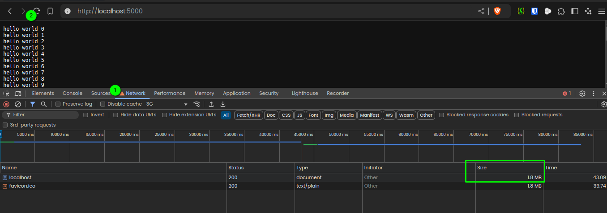
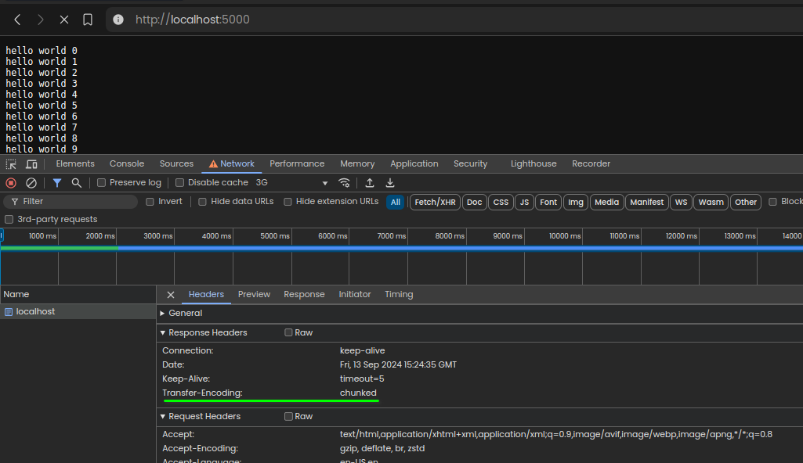

# using Read stream

below code is not so good to send data over server:

``` js
http.createServer(function (req, res) {
    // this  is bad because 1.8mb of data will be sent 
    const text = fs.readFileSync('./content/big.txt', 'utf8')
    res.end(text)

  }).listen(5000)
```
output: 1.8mb data in response




## below approach is good to handle big files:

``` js
http.createServer(function (req, res) {
    const fileStream = fs.createReadStream('./content/big.txt', 'utf8')
    fileStream.on('open', () => {
      fileStream.pipe(res)
    })
    fileStream.on('error', (err) => {
      res.end(err)
    })
    
  }).listen(5000)
```
see the chunked data:

